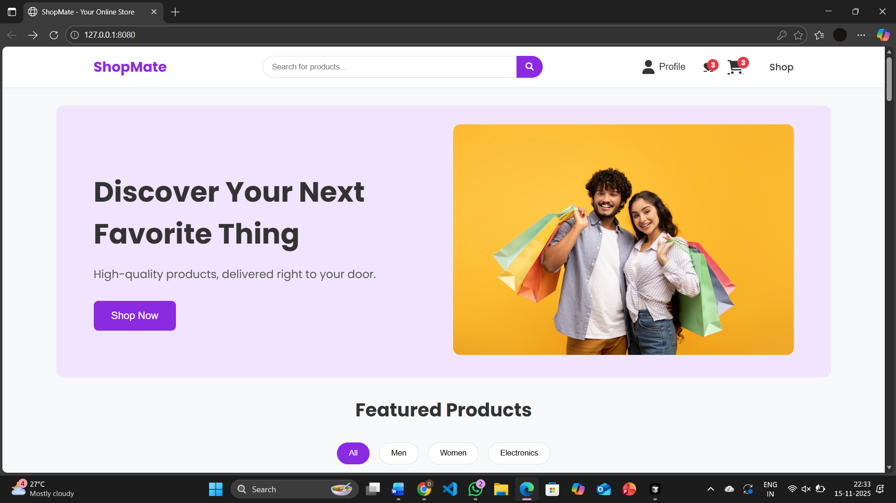
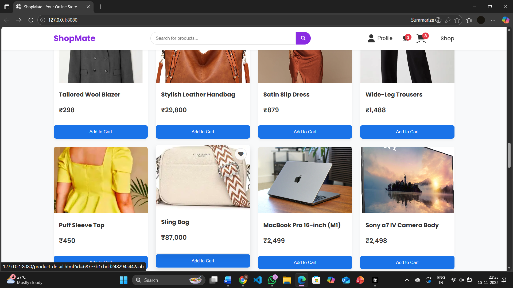
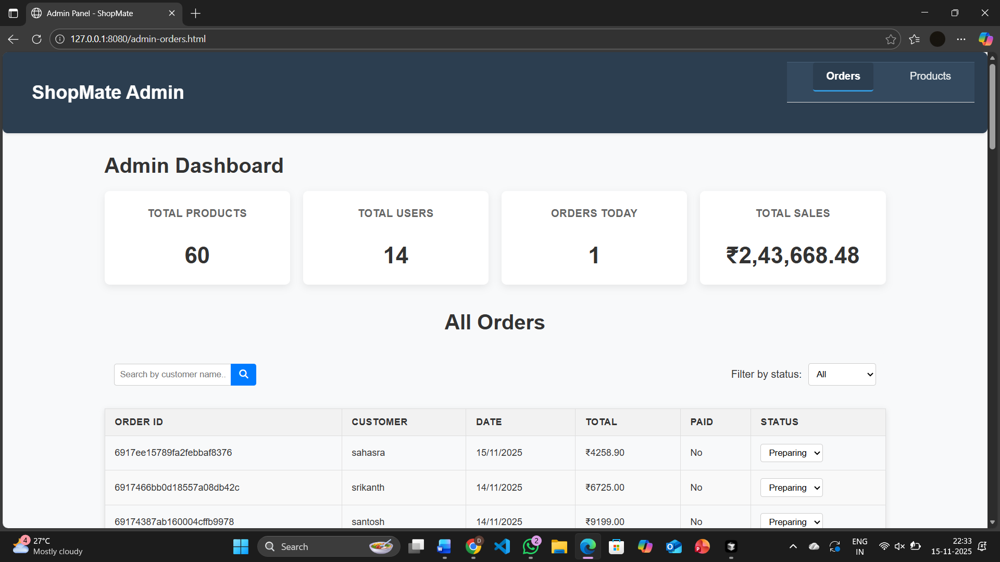
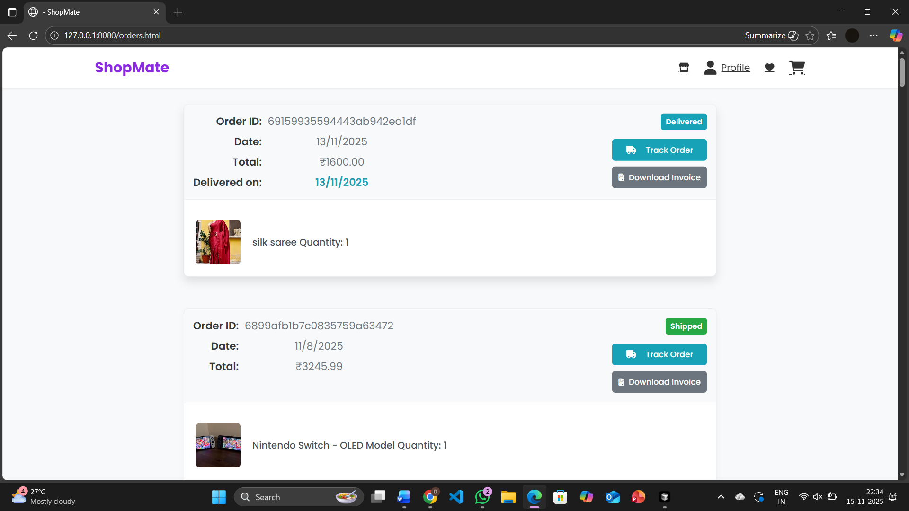

ShopMate – Full Stack E-Commerce Website

A complete full-stack e-commerce web application built using HTML, CSS, JavaScript, Node.js, and MongoDB.
This project simulates a real-world online shopping platform with both user and admin functionalities, designed especially as a simple solution for small businesses to go online.

---

 Features

User Features

- User Registration & Login (Authentication)
- Browse Products
- Add to Cart & Wishlist
- Place Orders
- Track Order Status
- Download Invoice (PDF)
- Product Reviews & Ratings
- Email Notifications for Order Updates

 Admin Features

- Admin Dashboard
- Add / Edit / Delete Products
- View All Orders from Users
- Update Order Status (Shipped, Delivered, etc.)
- Manage Products Efficiently

---

Purpose of the Project

The purpose of this project is to understand how real-world e-commerce platforms work internally by building a complete system from scratch.

It is also designed as a lightweight and customizable solution for small shops and local businesses, helping them:

- Create their own online store
- Manage products and orders easily
- Sell products without needing complex platforms

---

 Tech Stack

Frontend:

- HTML
- CSS
- JavaScript

Backend:

- Node.js
- Express.js

Database:

- MongoDB

Other Tools:

- Nodemailer (Email Notifications)
- PDF Generator (Invoice Download)

---

📂 Project Structure

project-root/

├── frontend/        # HTML, CSS, JS files
├── backend/         # Node.js + Express APIs
├── models/          # MongoDB schemas
├── routes/          # API routes
├── controllers/     # Business logic
├── config/          # Database configuration
└── README.md

---

 Results

###  Home Page

### Product Page

###  Admin Panel

###  Orders Page

 
